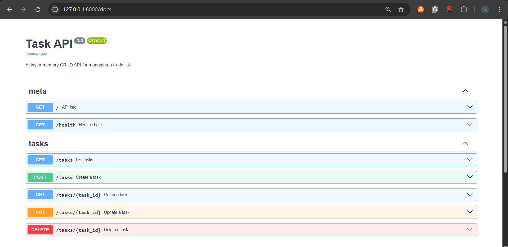
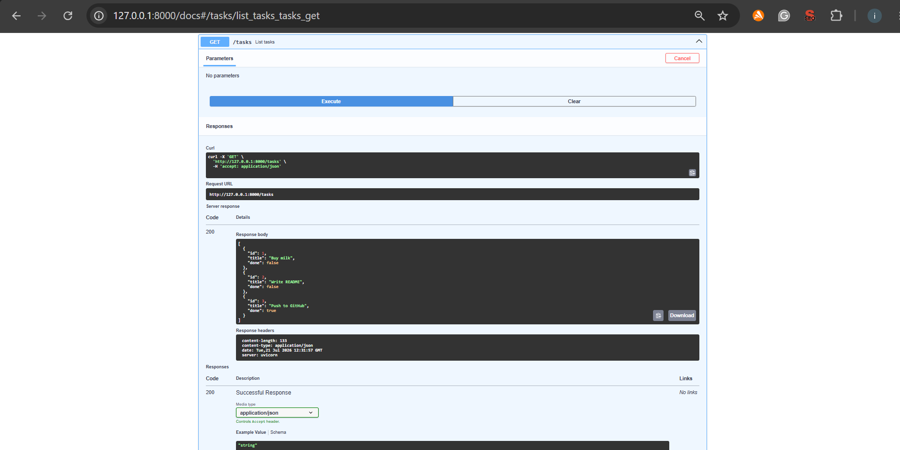
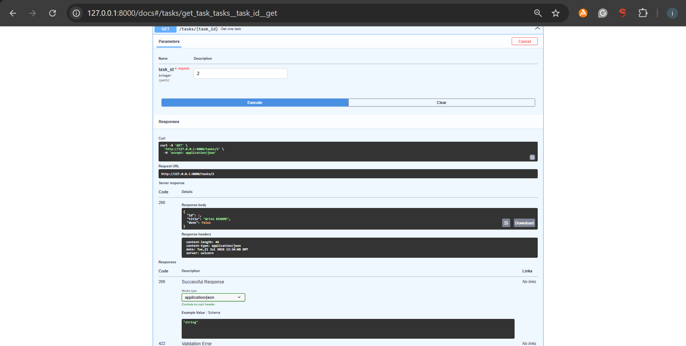

# Task CRUD API

A small in-memory CRUD API for managing a to-do list, built with **Python + FastAPI**
as part of the BE-01 assignment ("Build your first CRUD API").

There is no database, tasks live in a Python list in memory and are lost when the
server restarts. That's intentional, a database comes in the next assignment.

## How to run it

```bash
python3 -m venv venv
source venv/bin/activate        # Windows: venv\Scripts\activate
pip install -r requirements.txt

uvicorn main:app --reload --port 8000
```

Then open:
- http://localhost:8000 — API info
- http://localhost:8000/docs — Swagger UI (interactive docs, built in with FastAPI)

## Endpoints

| Method | Path            | Description                          | Success | Errors           |
|--------|-----------------|---------------------------------------|---------|-------------------|
| GET    | `/`             | API info                              | 200     | —                 |
| GET    | `/health`       | Health check                          | 200     | —                 |
| GET    | `/tasks`        | List all tasks (`?done=`, `?search=` filters) | 200     | —                 |
| GET    | `/tasks/{id}`   | Get one task                          | 200     | 404 unknown id    |
| POST   | `/tasks`        | Create a task (`{"title": "..."}`)    | 201     | 400 missing/empty title |
| PUT    | `/tasks/{id}`   | Replace a task's title/done           | 200     | 400 invalid body, 404 unknown id |
| DELETE | `/tasks/{id}`   | Delete a task                         | 204     | 404 unknown id    |
| GET    | `/stats`        | `{ "total", "done", "open" }`         | 200     | —                 |
| POST   | `/reset`        | Reset to the 3 example tasks          | 200     | —                 |


## Swagger UI

Full endpoint overview:


Example of a live request/response via "Try it out":

