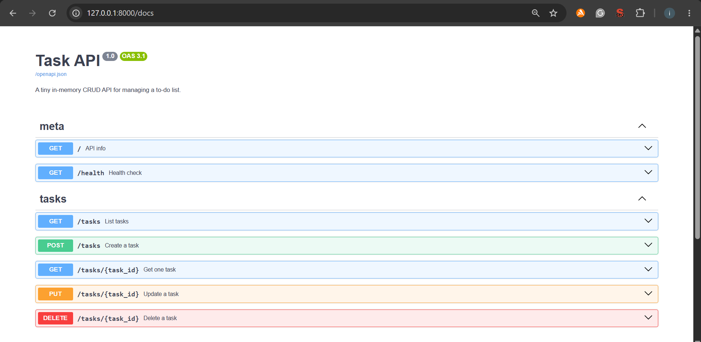
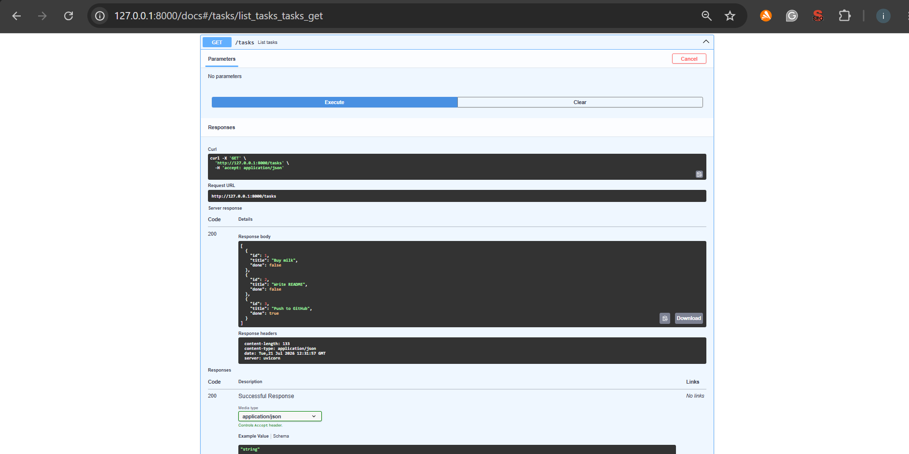
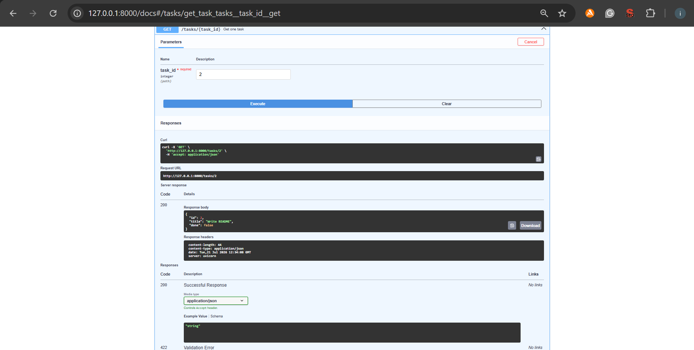

# Task CRUD API

A CRUD API for managing a to-do list, built with Python + FastAPI, now backed by a real SQLite database instead of an in-memory list (BE-02 assignment).

The API itself didn't change from Assignment 1, same endpoints, same request/response shapes, same status codes. Only the storage layer changed: tasks now live in tasks.db and survive server restarts.

# Why SQLite

SQLite was chosen because it needs no separate database server or installation — it's just a single file on disk (tasks.db) that Python's built-in sqlite3 module reads and writes directly. No setup step for anyone cloning the repo, but it still behaves like a real relational database instead of a temporary in-memory list.

# Where the database file is stored

tasks.db is created automatically in the project's root folder, next to main.py, the first time the server starts. It is not committed to git — each clone of this repo generates its own fresh database on first run.

## How to run it

```bash
python3 -m venv venv
source venv/bin/activate        # Windows: venv\Scripts\activate
pip install -r requirements.txt

uvicorn main:app --reload --port 8000
```
Then open:
- http://localhost:8000 — API info
- http://localhost:8000/docs — Swagger UI (interactive docs, built in with FastAPI)

On first run, tasks.db is created automatically with a tasks table and 3 seeded example tasks. On every later run, the existing data is reused, the 3 examples are only inserted once, when the table is empty.

## Endpoints

| Method | Path            | Description                          | Success | Errors           |
|--------|-----------------|---------------------------------------|---------|-------------------|
| GET    | `/`             | API info                              | 200     | —                 |
| GET    | `/health`       | Health check                          | 200     | —                 |
| GET    | `/tasks`        | List all tasks (`?done=`, `?search=` filters) | 200     | —                 |
| GET    | `/tasks/{id}`   | Get one task                          | 200     | 404 unknown id    |
| POST   | `/tasks`        | Create a task (`{"title": "..."}`)    | 201     | 400 missing/empty title |
| PUT    | `/tasks/{id}`   | Replace a task's title/done           | 200     | 400 invalid body, 404 unknown id |
| DELETE | `/tasks/{id}`   | Delete a task                         | 204     | 404 unknown id    |
| GET    | `/stats`        | `{ "total", "done", "open" }`         | 200     | —                 |
| POST   | `/reset`        | Reset to the 3 example tasks          | 200     | —                 |


# Persistence proof
Create a task via POST /tasks.
Stop the server (Ctrl+C).
Start it again: uvicorn main:app --reload --port 8000.
GET /tasks — the task is still there.

Unlike Assignment 1's in-memory list, restarting the server no longer wipes the data.

# One example SQL query I ran

Opened tasks.db in DB Browser for SQLite and ran:

SELECT * FROM tasks WHERE done = 1;


This returned only the completed task ("Push to GitHub"), confirming the done column correctly filters completed vs. open tasks.

# Database viewer screenshots

All tasks, including ones created through the API:

Query filtering for completed tasks only:


## Swagger UI

Full endpoint overview:


Example of a live request/response via "Try it out":

