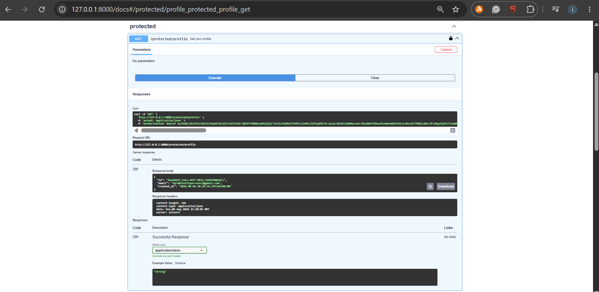

# Task CRUD API — with Authentication

A CRUD API for managing a to-do list, built with **Python + FastAPI**, running in
**Docker** with **PostgreSQL**, with **Supabase-backed authentication** protecting
selected routes.

The task CRUD routes (`/tasks`, `/tasks/{id}`, etc.) are unaffected by this stage
and remain open, exactly as before. Auth is new, additive functionality.

## What's new in this stage

| Method | Path                    | Auth required? | Purpose |
|--------|-------------------------|-----------------|---------|
| POST   | `/auth/signup`          | No              | Create a new account via Supabase |
| POST   | `/auth/login`           | No              | Log in, receive a JWT access token |
| POST   | `/auth/logout`          | Yes             | End the session |
| GET    | `/public/info`          | No              | Demo of an open route |
| GET    | `/protected/profile`    | Yes             | Returns the logged-in user's info |
| GET    | `/protected/dashboard`  | Yes             | Second protected route, same middleware |

## Architecture

- `supabase_client.py` — initializes the Supabase client from `SUPABASE_URL` /
  `SUPABASE_KEY` in the environment.
- `auth_dependency.py` — `get_current_user()`, a reusable FastAPI dependency
  (the "middleware" from Stage 4). Extracts the bearer token, verifies it against
  Supabase, and hands the verified user object to any route that depends on it.
  Written once, applied to every protected route — no duplicated token-checking
  logic anywhere.
- `auth_routes.py` — `/auth/signup`, `/auth/login`, `/auth/logout`.
- `protected_routes.py` — `/public/info`, `/protected/profile`,
  `/protected/dashboard`.
- `main.py` — wires the two new routers in via `app.include_router(...)`; the
  task routes and their error handlers are otherwise untouched.

## How auth works here (the trust triangle)

1. Client sends email/password to `/auth/signup` or `/auth/login`.
2. This server forwards those credentials to **Supabase** — passwords are never
   stored or hashed by this app.
3. Supabase returns a JWT (`access_token`) on successful login.
4. The client sends that token on later requests as
   `Authorization: Bearer <token>`.
5. `get_current_user()` extracts the token and calls Supabase's
   `auth.get_user(token)` to verify it's real and not expired — only then does
   the protected route's actual logic run.

## Setting up your own Supabase project

1. Create a free account at [supabase.com](https://supabase.com) and a new project.
2. Go to **Project Settings → API** in the dashboard, copy the **Project URL** and
   **anon public key**.
3. Under **Authentication → Providers → Email**, check whether "Confirm email" is
   enabled. If it is, new signups must click a confirmation link (sent to their
   inbox) before they can log in — expected behavior, not a bug, but worth
   disabling temporarily for faster local testing.

## How to run it

```bash
cp .env.example .env
```

Fill in `.env` with your Postgres `DATABASE_URL` and your Supabase `SUPABASE_URL` /
`SUPABASE_KEY`.

```bash
docker compose up --build
```

(`--build` is needed the first time, since `requirements.txt` now includes the
`supabase` package.)

Then open:
- http://localhost:8000/docs — Swagger UI. Protected routes show a padlock icon;
  click **Authorize**, paste a JWT (no `Bearer ` prefix needed — Swagger adds it),
  and "Try it out" works directly from the browser.

## Status codes

| Status | When |
|--------|------|
| 201 | Successful signup |
| 200 | Successful login, successful read of a protected route |
| 204 | Successful logout |
| 400 | Missing/empty email or password on signup or login, or Supabase rejects the email as invalid |
| 401 | Missing token, malformed token, invalid token, expired/revoked token, or wrong login credentials |

All errors use the same `{"error": "..."}` shape as the rest of this API — the
existing exception handlers in `main.py` already cover the `HTTPException`s
raised by the auth routes, no separate error-formatting code was needed.

## Tested flow (real Supabase project, not mocked)

```
POST /auth/signup   {"email": "...+test1@gmail.com", "password": "password123"}
  -> 201, real Supabase user: id, email, created_at

POST /auth/login     (same credentials, after confirming the email)
  -> 200, real JWT access_token returned

GET /protected/profile   Authorization: Bearer <token>
  -> 200, same user id/email/created_at returned -- token correctly verified

GET /protected/profile   Authorization: Bearer garbage
  -> 401 {"error": "Invalid or expired token"}

POST /auth/logout   Authorization: Bearer <token>
  -> 204, no body

GET /protected/dashboard   Authorization: Bearer <the now-logged-out token>
  -> 401 {"error": "Invalid or expired token"}
  (confirms logout genuinely revokes the session server-side in Supabase,
  not just a no-op that returns 204 without real effect)

(fresh login, new token)
GET /protected/dashboard   Authorization: Bearer <fresh token>
  -> 200 {"message": "Welcome to your dashboard, ...!"}
```

Also verified visually in Swagger UI: padlock icons appear on `/auth/logout`,
`/protected/profile`, and `/protected/dashboard`; clicking **Authorize** and
pasting a token lets "Try it out" succeed on protected routes directly from the
browser.



## What I noticed

The task CRUD routes and their error handlers didn't need a single change to add
authentication — the new logic lives entirely in its own files (`auth_routes.py`,
`protected_routes.py`, `auth_dependency.py`, `supabase_client.py`) and gets wired
in with two `include_router()` calls in `main.py`.

Logout turned out to do more than I expected: reusing a token after calling
`/auth/logout` genuinely fails with a 401, not just a symbolic "goodbye" response.
That means Supabase revokes the session server-side, not just on the client -- a
useful thing to have actually confirmed by testing, rather than assumed from
reading the docs.